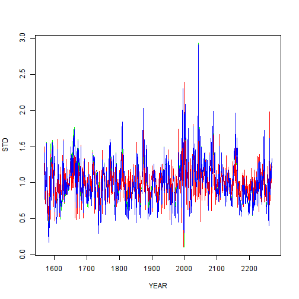

####  Using neural network for create regression model CLIs-CRNs
  + <https://yandex.ru/maps/-/CZwvQZpz>

```r
rm(list=ls())
assign("last.warning", NULL, envir = baseenv())
source("http://tmeits.github.io/24516/transect/setdw.R")
wd <- "C:/Users/IVA/Dropbox/24516/nnet_transect/nnet_24643"
wd <- "Z:/home/larisa/Dropbox/24516/nnet_transect/nnet_24643"
setwd(wd)
```
#### Reading generalized chronologies from the site https://www.ncdc.noaa.gov/paleo/chron_table.html
  + <https://www.ncdc.noaa.gov/paleo/meas_table.html>
  + <ftp://ftp.ncdc.noaa.gov/pub/data/paleo/treering/updates/schweingruber/chronologies/russ055/russ055w_tabs.crn>
  + <ftp://ftp.ncdc.noaa.gov/pub/data/paleo/treering/updates/schweingruber/chronologies/russ055/russ055w_out.txt>
  + <https://s3.amazonaws.com/assets.datacamp.com/img/blog/data+table+cheat+sheet.pdf>

```r
library(reshape2)
library(data.table)
# http://meteo.ru/data/155-meteostations
# 63.23, 125.48   63.95, 124.83  https://yandex.ru/maps/-/CZwvQZpz
DTw <- fread("ftp://ftp.ncdc.noaa.gov/pub/data/paleo/treering/updates/schweingruber/chronologies/russ055/russ055w_tabs.crn")
DTe <- fread("ftp://ftp.ncdc.noaa.gov/pub/data/paleo/treering/updates/schweingruber/chronologies/russ055/russ055e_tabs.crn")
str(DTw)
```

```
## Classes 'data.table' and 'data.frame':	703 obs. of  8 variables:
##  $ YEAR: int  1568 1569 1570 1571 1572 1573 1574 1575 1576 1577 ...
##  $ NUM : num  1 1 1 1 1 1 1 1 1 1 ...
##  $ SEG : num  356 356 356 356 356 356 356 356 356 356 ...
##  $ AGE : num  1 2 3 4 5 6 7 8 9 10 ...
##  $ RAW : num  0.25 0.31 0.51 0.29 0.31 0.34 0.23 0.44 0.57 0.28 ...
##  $ STD : num  0.762 0.917 1.436 0.858 0.907 ...
##  $ RES : num  0.825 1.033 1.496 0.703 0.924 ...
##  $ ARS : num  0.773 0.905 1.411 0.886 0.922 ...
##  - attr(*, ".internal.selfref")=<externalptr>
```

```r
head(DTw)
```

```
##    YEAR NUM SEG AGE  RAW   STD   RES   ARS
## 1: 1568   1 356   1 0.25 0.762 0.825 0.773
## 2: 1569   1 356   2 0.31 0.917 1.033 0.905
## 3: 1570   1 356   3 0.51 1.436 1.496 1.411
## 4: 1571   1 356   4 0.29 0.858 0.703 0.886
## 5: 1572   1 356   5 0.31 0.907 0.924 0.922
## 6: 1573   1 356   6 0.34 0.982 1.029 0.969
```

```r
DTw[YEAR %in% c(1:5000)]
```

```
##      YEAR NUM SEG AGE  RAW   STD   RES   ARS
##   1: 1568   1 356   1 0.25 0.762 0.825 0.773
##   2: 1569   1 356   2 0.31 0.917 1.033 0.905
##   3: 1570   1 356   3 0.51 1.436 1.496 1.411
##   4: 1571   1 356   4 0.29 0.858 0.703 0.886
##   5: 1572   1 356   5 0.31 0.907 0.924 0.922
##  ---                                        
## 699: 2266   1 557 553 0.19 1.169 1.131 1.172
## 700: 2267   1 557 554 0.16 1.011 0.923 1.024
## 701: 2268   1 557 555 0.17 1.079 1.049 1.080
## 702: 2269   1 557 556 0.19 1.206 1.167 1.205
## 703: 2270   1 557 557 0.21 1.335 1.234 1.341
```

```r
length(c(min(DTw[,YEAR]): max(DTw[,YEAR]))) == length(DTw[,YEAR])
```

```
## [1] TRUE
```

```r
DTw[, .(YEAR,STD)]
```

```
##      YEAR   STD
##   1: 1568 0.762
##   2: 1569 0.917
##   3: 1570 1.436
##   4: 1571 0.858
##   5: 1572 0.907
##  ---           
## 699: 2266 1.169
## 700: 2267 1.011
## 701: 2268 1.079
## 702: 2269 1.206
## 703: 2270 1.335
```

```r
DTw[, plot(YEAR,STD,type="l", col="green")]
```

```
## NULL
```

```r
DTw[, lines(YEAR,RES,type="l", col="red")]
```

```
## NULL
```

```r
DTw[, lines(YEAR,ARS,type="l", col="blue")]
```



```
## NULL
```
#### Read climate station data 24643 (Temperature, precipitation, illumination)

```r
DT.temp_url <- "https://raw.githubusercontent.com/tmeits/24516/master/nnet_24643/24643_temp.txt"
DTt <- fread(DT.temp_url)
str(DTt)
```

```
## Classes 'data.table' and 'data.frame':	59 obs. of  14 variables:
##  $ V1 : int  24643 24643 24643 24643 24643 24643 24643 24643 24643 24643 ...
##  $ V2 : int  1957 1958 1959 1960 1961 1962 1963 1964 1965 1966 ...
##  $ V3 : num  -47.6 -42.2 -43.5 -43.1 -44.6 -35.4 -33.6 -35.8 -42.1 -41.8 ...
##  $ V4 : num  NA -35.9 -30.5 -35.5 -33.8 -29.7 -31.6 -34 -38.6 -42.4 ...
##  $ V5 : num  -30.5 -26.2 -15.8 -26.1 -24.2 -23.1 -21.8 -23.8 -23.2 -26.6 ...
##  $ V6 : num  -7.1 -10.7 -11.1 -10.4 -10.6 -9.5 -12.1 -12.5 -8.6 -10.8 ...
##  $ V7 : num  3.3 2.7 2.2 3.8 3 3.9 0 1.9 3 5.1 ...
##  $ V8 : num  13.7 11.3 17.2 15.8 13.8 11.3 12.4 13.9 11.9 15.6 ...
##  $ V9 : num  17.3 17 14.9 17.7 17 17.6 16.4 18.9 17.2 15.1 ...
##  $ V10: num  13.9 13.8 15.9 12.1 13.6 13.8 13.8 12.7 14.4 13.8 ...
##  $ V11: num  1.3 5.6 6.7 4.7 6.1 2 4.8 3.4 6.6 3.5 ...
##  $ V12: num  -11 -11 -8.4 -11.4 -8 -8.6 -7.4 -11.5 -9.3 -9.6 ...
##  $ V13: num  -32.6 -30.4 -24 -31.2 -27.4 -30 -26.2 -30.4 -31.4 -31.8 ...
##  $ V14: num  -37.7 -40.5 -38.5 -39.5 -33.9 -39.1 -38.2 -42.1 -44.9 -37.5 ...
##  - attr(*, ".internal.selfref")=<externalptr>
```

```r
Month <- c("Jan", "Feb", "Mar", "Apr", "May", "Jun", "Jul", "Aug", "Sep", "Oct", "Nov", "Dec")
toupper(Month)
```

```
##  [1] "JAN" "FEB" "MAR" "APR" "MAY" "JUN" "JUL" "AUG" "SEP" "OCT" "NOV"
## [12] "DEC"
```

```r
tolower(Month)
```

```
##  [1] "jan" "feb" "mar" "apr" "may" "jun" "jul" "aug" "sep" "oct" "nov"
## [12] "dec"
```

```r
setnames(DTt,  names(DTt), c(c("WMO","YEAR"), Month))
names(DTt)
```

```
##  [1] "WMO"  "YEAR" "Jan"  "Feb"  "Mar"  "Apr"  "May"  "Jun"  "Jul"  "Aug" 
## [11] "Sep"  "Oct"  "Nov"  "Dec"
```

```r
summary(DTt)
```

```
##       WMO             YEAR           Jan              Feb        
##  Min.   :24643   Min.   :1957   Min.   :-47.60   Min.   :-43.70  
##  1st Qu.:24643   1st Qu.:1972   1st Qu.:-42.88   1st Qu.:-36.50  
##  Median :24643   Median :1986   Median :-39.70   Median :-34.00  
##  Mean   :24643   Mean   :1986   Mean   :-39.61   Mean   :-34.57  
##  3rd Qu.:24643   3rd Qu.:2000   3rd Qu.:-36.85   3rd Qu.:-32.80  
##  Max.   :24643   Max.   :2015   Max.   :-32.10   Max.   :-26.30  
##                                 NA's   :1        NA's   :2       
##       Mar              Apr               May             Jun       
##  Min.   :-30.50   Min.   :-12.700   Min.   :0.000   Min.   :10.80  
##  1st Qu.:-24.00   1st Qu.:-10.275   1st Qu.:3.150   1st Qu.:12.90  
##  Median :-23.00   Median : -8.300   Median :4.800   Median :14.35  
##  Mean   :-22.12   Mean   : -8.134   Mean   :4.590   Mean   :14.33  
##  3rd Qu.:-21.35   3rd Qu.: -6.625   3rd Qu.:5.925   3rd Qu.:15.38  
##  Max.   :-12.40   Max.   : -1.300   Max.   :8.500   Max.   :18.40  
##                   NA's   :1         NA's   :7       NA's   :3      
##       Jul             Aug             Sep             Oct         
##  Min.   :14.70   Min.   :11.10   Min.   :1.300   Min.   :-14.500  
##  1st Qu.:17.00   1st Qu.:12.72   1st Qu.:3.825   1st Qu.:-11.000  
##  Median :17.65   Median :13.80   Median :4.700   Median : -9.300  
##  Mean   :17.77   Mean   :13.70   Mean   :4.667   Mean   : -9.356  
##  3rd Qu.:18.88   3rd Qu.:14.38   3rd Qu.:5.300   3rd Qu.: -8.000  
##  Max.   :21.80   Max.   :16.50   Max.   :8.800   Max.   : -4.400  
##  NA's   :1       NA's   :1       NA's   :1       NA's   :2        
##       Nov              Dec        
##  Min.   :-36.70   Min.   :-44.90  
##  1st Qu.:-31.30   1st Qu.:-40.50  
##  Median :-29.80   Median :-38.40  
##  Mean   :-29.22   Mean   :-38.34  
##  3rd Qu.:-27.00   3rd Qu.:-36.90  
##  Max.   :-21.00   Max.   :-31.40  
##  NA's   :2        NA's   :2
```

```r
# https://sites.ualberta.ca/~ahamann/teaching/renr690/R_Cheat_Data.pdf
# https://xi-liang.com/2016/02/16/master-dplyr/
#http://predictive5.com/2015/05/19/dplyr-%D0%B4%D0%BB%D1%8F-%D0%BC%D0%B0%D0%BD%D0%B8%D0%BF%D1%83%D0%BB%D1%8F%D1%86%D0%B8%D0%B8-%D0%B4%D0%B0%D0%BD%D0%BD%D1%8B%D0%BC%D0%B8-%D0%B2-r-%D1%87%D0%B0%D1%81%D1%82%D1%8C-1/
#https://rpubs.com/aa989190f363e46d/dplyr_intro
#http://r.psylab.info/blog/2015/04/21/magrittr/
#https://www.rstudio.com/wp-content/uploads/2015/02/data-wrangling-cheatsheet.pdf
#!http://r.psylab.info/blog/2015/06/11/remove-na-performance/
#http://r.psylab.info/blog/2015/04/15/parse-html/ !!!!
```
####

```r
gen_data <- function(nrow = 10e3, ncol = 10, na.perc = 0.1) {
    m <- replicate(ncol, runif(nrow))
    for (col in 1:ncol) {
        idx <- sample(1:nrow, size = floor(nrow * na.perc))
        m[idx, col] <- NA
    }
    return(as.data.frame(m))
}
```
#### Tips

```r
#http://www.habrahabr.net/thread/4406
#http://r-analytics.blogspot.ru/2012/11/shiny-r.html#.WDGSy8WalKg
#http://biostat-r.blogspot.ru/2016/01/tidy-data.html#more  !!!!!
#http://belousovv.ru/markdown_syntax
#http://cyberleninka.ru/article/n/postroenie-bystryh-approksimatsionnyh-moduley-resheniya-zadach-vysokochastotnogo-elektromagnitnogo-karotazha
#ttp://sil.uc.edu/pdfFiles/pawel/PN_ITM2012_WRF_Ozone.pdf
#http://pca.narod.ru/lecture4.htm
#https://geektimes.ru/post/211610/
#http://swblog.ru/articles/other/postroenie-nejronnoj-seti.html
#https://geographyofrussia.com/set-meteostancij/
#http://aakinshin.net/ru/about/
#https://rstudio-pubs-static.s3.amazonaws.com/65323_76ad54e90cd845eab4b7569c81c9d5b0.html
#https://cran.r-project.org/web/views/ReproducibleResearch.html
#http://ru.stackoverflow.com/questions/467172/%D0%9A%D0%B0%D0%BA-%D0%BF%D0%B5%D1%80%D0%B5%D0%BD%D0%B5%D1%81%D1%82%D0%B8-%D1%82%D0%B0%D0%B1%D0%BB%D0%B8%D1%86%D1%83-%D0%B2-%D1%83%D0%B4%D0%BE%D0%B1%D0%BD%D1%8B%D0%B9-%D0%B4%D0%BB%D1%8F-%D0%BF%D1%83%D0%B1%D0%BB%D0%B8%D0%BA%D0%B0%D1%86%D0%B8%D0%B8-%D1%84%D0%BE%D1%80%D0%BC%D0%B0%D1%82
#https://www.ncdc.noaa.gov/paleo/treeinfo.html


#https://habrahabr.ru/company/infopulse/blog/301914/
#https://statist.shinyapps.io/bioeq/
# http://web.utk.edu/~grissino/software.htm#dendrometer
# https://toster.ru/q/79828
# http://matlab.exponenta.ru/neuralnetwork/book1/task1/task1.php
# https://www.r-bloggers.com/fitting-a-neural-network-in-r-neuralnet-package/
# https://heuristically.wordpress.com/2011/11/17/using-neural-network-for-regression/
# https://www.r-bloggers.com/general-regression-neural-network-with-r/
# http://gekkoquant.com/2012/05/26/neural-networks-with-r-simple-example/
# https://rpubs.com/mbaumer/NeuralNetworks
# https://beckmw.wordpress.com/2014/12/20/neuralnettools-1-0-0-now-on-cran/
# https://bzstat.wordpress.com/2011/07/10/using-lib-fann-in-r-via-rcpp/
# install.packages('NeuralNetTools', dependencies=TRUE, repos='http://cran.rstudio.com/')
# install.packages('neuralnet', dependencies=TRUE, repos='http://cran.rstudio.com/')
# install.packages('txtplot', dependencies=TRUE, repos='http://cran.rstudio.com/')
# install.packages('tcltk', dependencies=TRUE, repos='http://cran.rstudio.com/')
# install.packages('dplyr', dependencies=TRUE, repos='http://cran.rstudio.com/')

# http://www.theanalysisfactor.com/r-programming-plotting-color-part-2-qplot/
# http://brooksandrew.github.io/simpleblog/articles/deploying-apps-with-shinyapps-io/
# http://user2014.stat.ucla.edu/files/tutorial_Matt.pdf
```
#### Atom 

D410PTL
DG945GCLF
http://cdimage.ubuntu.com/ubuntu-mate/releases/16.04.1/release/ubuntu-mate-16.04.1-desktop-i386.iso
http://ark.intel.com/ru/products/48480/Intel-Desktop-Board-D410PTL
http://www.nix.ru/autocatalog/motherboards_intel/INTEL-D410PTL-OEM-Atom-D410-NM10-SVGA-plus-LAN-SATA-Mini-ITX-2DDR2-PC2-5300_97721.html
http://ark.intel.com/products/69042/Intel-Desktop-Board-D2550MUD2
KVR1333D3S8S9/2G
PC3-10600 CL9 204 
http://www.intel.com/content/dam/support/us/en/documents/motherboards/desktop/d525mw/d525mw_d525mwv_techprodspec03.pdf


```r
#
```
