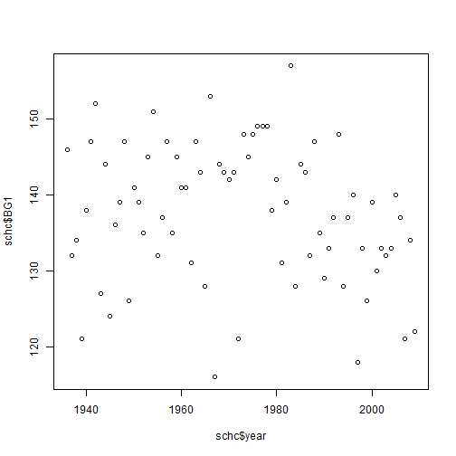
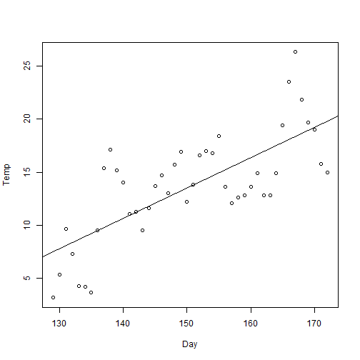

***
### Author : Iljin Victor,  Date   : 31/09/2016
### Liberation Mono 9pt
***


```r
## Set work path
getOsVersion <- function() {
    sysinf <- Sys.info()
    if (!is.null(sysinf)) 
        osVersion <- sysinf["version"] else stop("mystery machine...")
    return(osVersion)
}
getOsVersion()
```

```
##                      version 
## "build 7601, Service Pack 1"
```

```r
# Installation of a working directory
setWorkDir <- function(osVersion) {
    if (osVersion == "build 2600, Service Pack 3") 
        setwd("Z:/home/larisa/Dropbox/24516/transect/")
    else if (osVersion == "#32-Ubuntu SMP Fri Apr 16 08:10:02 UTC 2010")
        setwd("/home/larisa/Dropbox/24516/transect/")
    else if (osVersion == "build 7601, Service Pack 1")
        setwd("C:/Users/IVA/Dropbox/24516/transect/") else stop("mystery...")
    return(getwd())
}
mm_path <- setWorkDir(getOsVersion())
mm_path
```

```
## [1] "C:/Users/IVA/Dropbox/24516/transect"
```
#### Read test datasets
#### Work with weather data <http://aisori.meteo.ru/ClimateR> [R]

```r
readClimateMinusinsk <- function(url) {
    sm.cli <- read.csv(url, header = FALSE, sep = ";", dec = ".")
    sm.cli <- sm.cli[-c(5, 7, 9, 11, 13, 14)]  # we delete excess columns
    sm.cli <- setNames(sm.cli, c("Station", "Year", "Month", "Day", "TMIN", "TMEAN",
        "TMAX", "PRECIP"))  # Assign columns names
    # 53.42N 91.42E
    Minusinsk.cli <- sm.cli[sm.cli$Station == 29866, ]
    return(Minusinsk.cli)
}

Minusinsk.cli <- readClimateMinusinsk(paste0(mm_path, "/SCH231.txt"))
tail(Minusinsk.cli)
```

```
##       Station Year Month Day  TMIN TMEAN TMAX PRECIP
## 59530   29866 2015    12  26  -6.2  -0.6  2.2    0.0
## 59531   29866 2015    12  27  -6.3  -1.0  3.2    0.0
## 59532   29866 2015    12  28  -8.8  -3.9  0.0    1.6
## 59533   29866 2015    12  29  -7.5  -2.6  2.9    0.0
## 59534   29866 2015    12  30  -9.8  -2.7  0.5    1.4
## 59535   29866 2015    12  31 -12.1  -7.9 -3.8    0.0
```

```r
str(Minusinsk.cli)
```

```
## 'data.frame':	38716 obs. of  8 variables:
##  $ Station: int  29866 29866 29866 29866 29866 29866 29866 29866 29866 29866 ...
##  $ Year   : int  1910 1910 1910 1910 1910 1910 1910 1910 1910 1910 ...
##  $ Month  : int  1 1 1 1 1 1 1 1 1 1 ...
##  $ Day    : int  1 2 3 4 5 6 7 8 9 10 ...
##  $ TMIN   : num  NA NA NA NA NA NA NA NA NA NA ...
##  $ TMEAN  : num  NA NA NA NA NA NA NA NA NA NA ...
##  $ TMAX   : num  NA NA NA NA NA NA NA NA NA NA ...
##  $ PRECIP : num  NA NA NA NA NA NA NA NA NA NA ...
```

```r
summary(Minusinsk.cli)
```

```
##     Station           Year          Month             Day       
##  Min.   :29866   Min.   :1910   Min.   : 1.000   Min.   : 1.00  
##  1st Qu.:29866   1st Qu.:1936   1st Qu.: 4.000   1st Qu.: 8.00  
##  Median :29866   Median :1962   Median : 7.000   Median :16.00  
##  Mean   :29866   Mean   :1962   Mean   : 6.523   Mean   :15.73  
##  3rd Qu.:29866   3rd Qu.:1989   3rd Qu.:10.000   3rd Qu.:23.00  
##  Max.   :29866   Max.   :2015   Max.   :12.000   Max.   :31.00  
##                                                                 
##       TMIN             TMEAN              TMAX             PRECIP        
##  Min.   :-52.200   Min.   :-50.100   Min.   :-41.500   Min.   :  0.0000  
##  1st Qu.:-16.100   1st Qu.:-10.000   1st Qu.: -3.600   1st Qu.:  0.0000  
##  Median : -2.400   Median :  3.200   Median :  9.600   Median :  0.0000  
##  Mean   : -5.232   Mean   :  1.118   Mean   :  8.174   Mean   :  0.9223  
##  3rd Qu.:  7.400   3rd Qu.: 14.200   3rd Qu.: 21.600   3rd Qu.:  0.4000  
##  Max.   : 22.400   Max.   : 29.200   Max.   : 39.300   Max.   :102.6000  
##  NA's   :2997      NA's   :2565      NA's   :6939      NA's   :2673
```

```r
sum(is.na(Minusinsk.cli))
```

```
## [1] 15174
```

```r
mean(is.na(Minusinsk.cli))
```

```
## [1] 0.04899137
```
### Read data file VS-model

```r
# Read data file VS-model
readCliBE <- function(url) {
   schc <- read.csv(url, header = TRUE, 
    sep = "", dec = ".")
    return(schc)
}
schc <-  readCliBE(paste0(mm_path, "/1936_2009.dat"))
schc <- schc[-c(2,3,4,5,6,9,10,11,12,13)]
head(schc)
```

```
##   year BG1 EG1
## 1 1936 146 271
## 2 1937 132 261
## 3 1938 134 267
## 4 1939 121 274
## 5 1940 138 264
## 6 1941 147 257
```

```r
str(schc)
```

```
## 'data.frame':	74 obs. of  3 variables:
##  $ year: int  1936 1937 1938 1939 1940 1941 1942 1943 1944 1945 ...
##  $ BG1 : int  146 132 134 121 138 147 152 127 144 124 ...
##  $ EG1 : int  271 261 267 274 264 257 264 285 271 262 ...
```

```r
# The calculation of duration in days growing season
cat("The calculation of duration in days growing season\n", schc$EG1-schc$BG1,"\n")
```

```
## The calculation of duration in days growing season
##  125 129 133 153 126 110 112 158 127 138 135 117 136 138 127 138 127 122 121 137 123 116 131 133 126 132 132 125 131 145 129 132 105 119 127 120 140 124 128 125 127 121 124 143 120 137 134 107 144 137 132 141 123 120 132 135 129 119 138 126 115 155 133 144 128 143 125 136 135 133 141 156 130 158
```

```r
summary(schc$EG1-schc$BG1)
```

```
##    Min. 1st Qu.  Median    Mean 3rd Qu.    Max. 
##   105.0   124.2   130.5   130.7   137.0   158.0
```

```r
summary(schc$EG1)
```

```
##    Min. 1st Qu.  Median    Mean 3rd Qu.    Max. 
##   248.0   263.2   268.0   268.4   273.0   285.0
```

```r
summary(schc$BG1)
```

```
##    Min. 1st Qu.  Median    Mean 3rd Qu.    Max. 
##   116.0   132.0   138.5   137.7   144.8   157.0
```

```r
# Reading of results VS model values for the beginning and end of the growing
# season for all mod. years
season_growthVS <- function(sgs, s.year) {
    return(c(sgs[sgs$year == s.year, ]$BG1, sgs[sgs$year == s.year, ]$EG1))
}
S64 <- season_growthVS(schc, 1964)
cat("Reading of results VS model ", S64, "\n")
```

```
## Reading of results VS model  143 274
```
### Utility functions

```r
# Reading climatic data in one year
get_one_year <- function(years, now) {
    return(years[years$Year == now, ])
}
Y64 <- get_one_year(Minusinsk.cli, 1964) # test
head(Y64)
```

```
##       Station Year Month Day  TMIN TMEAN  TMAX PRECIP
## 40543   29866 1964     1   1 -23.3 -18.5 -13.9    0.0
## 40544   29866 1964     1   2 -19.7 -17.0 -12.2    0.2
## 40545   29866 1964     1   3 -26.1 -20.0 -15.2    0.1
## 40546   29866 1964     1   4 -17.8  -9.6  -3.1    0.0
## 40547   29866 1964     1   5  -5.5  -3.6  -0.6    0.0
## 40548   29866 1964     1   6  -8.2  -6.5  -2.6    0.0
```

```r
summary(Y64[, 5:8])
```

```
##       TMIN             TMEAN              TMAX             PRECIP       
##  Min.   :-40.000   Min.   :-33.900   Min.   :-26.100   Min.   : 0.0000  
##  1st Qu.:-14.700   1st Qu.: -8.875   1st Qu.: -2.600   1st Qu.: 0.0000  
##  Median : -3.400   Median :  1.450   Median :  7.350   Median : 0.0000  
##  Mean   : -4.859   Mean   :  1.442   Mean   :  8.742   Mean   : 0.5776  
##  3rd Qu.:  7.100   3rd Qu.: 14.575   3rd Qu.: 22.550   3rd Qu.: 0.2000  
##  Max.   : 21.000   Max.   : 25.300   Max.   : 35.400   Max.   :12.6000
```

```r
# Assume the beginning of growing season the total transition temperature sumT for 10 consecutive days using a threshold value of 90 degrees Celsius. Then the beginning of the growing season can be considered the first day in this sequence, when conditions will be made (i.e., sumT>=90).
# the beginning of the growing season
seasonBG <- function(years, now) {
    year <- get_one_year(years, now)
    year <- na.omit(year)
    yearT <- year[, ]$TMEAN
    yearL <- length(yearT)
    for (i in 1:yearL) {
        sumT <- sum(yearT[i:(i + 10)])
        if (!is.na(sumT))
            if (sumT >= 90)
                return(i)
    }
    if(i >= yearL) stop("invalid begin day")
    return(i)
}
seasonBG(Minusinsk.cli, 1964)  # test
```

```
## [1] 115
```

```r
# By the end of the growing season to consider the following condition: when the sum of temperatures over 10 consecutive days is below 50 degrees. The end of the season - it's the last day in this sequence.
# the end of the growing season
seasonEG <- function(years, now) {
    year <- get_one_year(years, now)
    year <- na.omit(year)
    yearT <- year[, ]$TMEAN
    yearL <- length(yearT)
    firstDay <- seasonBG(years, now)
    if (firstDay >= yearL) 
        stop("invalid seasonBG day")
    for (i in firstDay:yearL) {
        sumT <- sum(yearT[i:(i + 10)])
        if (!is.na(sumT)) 
            if (sumT < 50) 
                return(i + 10)
    }
    return(i)
}
seasonEG(Minusinsk.cli, 1961)  # test
```

```
## [1] 278
```

```r
# Beginning and end of the growing season in the specified year
season_growth <- function(data.cli, needYear) {
    return(c(seasonBG(data.cli, needYear), seasonEG(data.cli, needYear)))
}
S64 <- season_growth(Minusinsk.cli, 1964)
cat("Reading of results season_growth ", S64, "\n")
```

```
## Reading of results season_growth  115 281
```

```r
# a function which converts date in number of days from the beginning of the
# year
num_days <- function(year, month, day) {
    D1 <- as.Date(paste(year, "-1-1", sep = ""))
    asd <- as.Date(paste(year, "-", month, "-", day, sep = ""))
    return(as.numeric(difftime(asd, D1, units = "day")))
}
ND <- num_days(1964, 6, 22)
cat("NumDay=", ND, "\n")
```

```
## NumDay= 173
```

```r
# Convert a vector of Year-Month-Day into a string suitable for
# reverse-conversion
date2string <- function(cDate) {
    sD <- paste(cDate[1], "-", cDate[2], "-", cDate[3], sep = "")  #; print(sD)
    D <- as.Date(sD)  # при неправильной дате выбросится исключение
    return(sD)
}
DS <- date2string(c(2007, 11, 12))
cat("Convert data as strung= ", DS, "\n")
```

```
## Convert data as strung=  2007-11-12
```
### Graphics (computed on VS and V. S.) for years beginning and end of the growing season.

```r
plot(schc$year, schc$BG1)
```


### Main functions

| Num  | Function  | Resume |
|---|---|---|
| 1  |  The sum of temperatures from 22 June to transition through 0C at the end of  | FT2205 |
| 2 |  The sum of temperatures from 22 June to transition through 5C at the end of | FT2205  |
| 3 |   |   |
| 4 |   |   |
| 5 |   |   |
| 6 |   |   |
| 7 |   |   |
| 8 |   |   |
| 9 |   |   |
| 10|   |   |
| 11|   |   |
| 12|   |   |
| 13|   |   |
| 14|   |   |
| 15|   |   |
| 16|   |   |


```r
# http://www.tablesgenerator.com/markdown_tables#
# SpeedT is the speed of the temperature rise since the beginning of the growing season until June 22 (the summer solstice). In fact, it is necessary to take daily temperature (time series with daily temperatures) since the beginning of the growing season (e.g. may 25) until June 22 and build for the temperature Tem trend line (i.e. the regression equation of the form=a+bt, where t is day, a and b are regression coefficients). In this case, SpeedT is the same as the coefficient b.
# Speed of rise in temperature
SPEEDT <- function(data.cli, needYear, densityPlot = FALSE) {
    year <- get_one_year(data.cli, needYear)
    year <- na.omit(year)
    sg <- season_growth(data.cli, needYear)
    L <-  sg[1]:num_days(needYear, 6, 22)
    DT <- data.frame(Day = L, Temp = year$TMEAN[L])
    if (densityPlot == TRUE) {
        plot(DT)
        abline(lm(formula = DT$Temp ~ DT$Day, data=DT))
        print(summary(lm(formula = DT$Temp ~ DT$Day, data=DT)))
    }
    DT.lm <- lm(formula = DT$Temp ~ DT$Day, data=DT)
    return(DT.lm$coefficients[2]) # b1
}

# http://www.montefiore.ulg.ac.be/~kvansteen/GBIO0009-1/ac20092010/Class8/Using%20R%20for%20linear%20regression.pdf
# https://ww2.coastal.edu/kingw/statistics/R-tutorials/simplelinear.html
# http://www.rpubs.com/smarcel/106230
# https://www.r-bloggers.com/interpreting-regression-coefficient-in-r/
#https://cran.r-project.org/doc/contrib/Shipunov-rbook.pdf
S <- SPEEDT(Minusinsk.cli, 1969, densityPlot = TRUE)
```



```
## 
## Call:
## lm(formula = DT$Temp ~ DT$Day, data = DT)
## 
## Residuals:
##     Min      1Q  Median      3Q     Max 
## -5.5746 -2.8873 -0.0402  2.5231  7.9313 
## 
## Coefficients:
##              Estimate Std. Error t value Pr(>|t|)    
## (Intercept) -29.09152    6.25954  -4.648 3.31e-05 ***
## DT$Day        0.28419    0.04144   6.857 2.33e-08 ***
## ---
## Signif. codes:  0 '***' 0.001 '**' 0.01 '*' 0.05 '.' 0.1 ' ' 1
## 
## Residual standard error: 3.491 on 42 degrees of freedom
## Multiple R-squared:  0.5282,	Adjusted R-squared:  0.517 
## F-statistic: 47.02 on 1 and 42 DF,  p-value: 2.327e-08
```

```r
S
```

```
##    DT$Day 
## 0.2841931
```

```r
#cat("SPEED= ", S, "\n")


# The sum of temperatures from 22 June to transition through 0C at the end of
# the season/temperatures from June 22 to transition through 5C at the end of
# the season
FT2205 <- function(data.cli, data.calc, s.year, temp.c = 0) {
    year <- get_one_year(data.cli, s.year)
    year <- na.omit(year)
    sg <- season_growth(data.calc, s.year)
    nd <- num_days(s.year, 6, 22)
    sum_temp <- 0
    for (i in nd:sg[2]) {
        if (year[i, ]$TMEAN > temp.c) {
            sum_temp <- sum_temp + year[i, ]$TMEAN
        }
    }
    return(sum_temp)
}
sum_temp0 <- FT2205(Minusinsk.cli, Minusinsk.cli, 1965, 0)
sum_temp5 <- FT2205(Minusinsk.cli, Minusinsk.cli, 1965, 5)
cat("FT2205= ", sum_temp0, sum_temp5, "\n")
```

```
## FT2205=  1758.6 1738.8
```

```r
# The sum of temperatures above 0C until June 22/the Sum of temperatures above
# 5C until June 22
T2205 <- function(data.cli, data.calc, s.year, temp.c = 0) {
    year <- get_one_year(data.cli, s.year)
    year <- na.omit(year)
    nd <- num_days(s.year, 6, 22)
    sum_temp <- 0
    for (i in 1:nd) {
        if (year[i, ]$TMEAN > temp.c) {
            sum_temp <- sum_temp + year[i, ]$TMEAN
        }
    }
    return(sum_temp)
}
sum_temp0 <- T2205(Minusinsk.cli, Minusinsk.cli, 1965, 0)
sum_temp5 <- T2205(Minusinsk.cli, Minusinsk.cli, 1965, 5)
cat("T2205= ", sum_temp0, sum_temp5, "\n")
```

```
## T2205=  970.3 917.5
```

```r
# The sum of temperatures more 0C - the Sum of temperatures more than 5C
SUMT0 <- function (data.cli, data.calc, s.year, temp.c = 0) {
  year <- get_one_year(data.cli, s.year)
  year <- na.omit(year)
  sum_temp <- 0
  for(i in 1: length(year[, 1])) {
    if(year[i, ]$TMEAN > temp.c) {
      sum_temp <- sum_temp + year[i, ]$TMEAN
    }
  }
  return(sum_temp)
}
# test
sum_temp0 <- SUMT0(Minusinsk.cli, Minusinsk.cli, 1963, 0)
sum_temp5 <- SUMT0(Minusinsk.cli, Minusinsk.cli, 1963, 5)
cat("SUMT0= ", sum_temp0, sum_temp5, "\n")
```

```
## SUMT0=  2320.4 2193.2
```

```r
# The date of transition through 0C-5C at the beginning of the growing season
STDAT0 <- function (data.cli, data.calc, s.year, temp.c = 0) {
  year <- get_one_year(data.cli, s.year)
  year <- na.omit(year)
  sg <- season_growth(data.calc, s.year)
  data.0c <- c(1, 1, 1)
  for(i in 1: length(year[, 1])) {
    if(year[i, ]$TMEAN >= temp.c & i >= sg[1]) {
      data.0c[3] <- year[i, ]$Year
      data.0c[2] <- year[i, ]$Month
      data.0c[1] <- year[i, ]$Day
      return(data.0c)
    }
  }
  stop("In the permafrost, the trees do not grow. Check climatico.")
}
R0 <- STDAT0(Minusinsk.cli, Minusinsk.cli, 1969)
R5 <- STDAT0(Minusinsk.cli, Minusinsk.cli, 1969, temp.c = 11)
cat("STDAT0= ", R0, R5, "\n")
```

```
## STDAT0=  9 5 1969 17 5 1969
```

```r
# Date of transition at the end of the season through 0C-5C
FDAT0 <- function (data.cli, data.calc, s.year, temp.c = 0) {
  year <- get_one_year(data.cli, s.year)
  year <- na.omit(year)
  sg <- season_growth(data.calc, s.year)
  data.0c <- c(1, 1, 1)
  for(i in sort(1: length(year[, 1]), decreasing = TRUE)) {
    if(year[i, ]$TMEAN >= temp.c & i <= sg[2]) {
      data.0c[3] <- year[i, ]$Year
      data.0c[2] <- year[i, ]$Month
      data.0c[1] <- year[i, ]$Day
      return(data.0c)
    }
  }
  stop("In the permafrost, the trees do not grow. Check climatico.")
}
R0 <- FDAT0(Minusinsk.cli, Minusinsk.cli, 1969)
R5 <- FDAT0(Minusinsk.cli, Minusinsk.cli, 1969, 5)
cat("FDAT0= ", R0, R5, "\n")
```

```
## FDAT0=  25 9 1969 18 9 1969
```

```r
# The duration of the season from 0C to 0C or 5C to 5C
INTER0 <- function(data.cli, data.calc, s.year, temp.c = 0) {
    year <- get_one_year(data.cli, s.year)
    sg <- season_growth(data.calc, s.year)
    lbeg <- STDAT0(data.cli, data.calc, s.year, temp.c)
    lend <- FDAT0(data.cli, data.calc, s.year, temp.c)
    
    startdate <- as.Date(paste(as.character(lbeg[3]), "-", as.character(lbeg[2]), 
        "-", as.character(lbeg[1]), sep = ""))
    enddate <- as.Date(paste(as.character(lend[3]), "-", as.character(lend[2]), 
        "-", as.character(lend[1]), sep = ""))
    # http://distrland.blogspot.ru/2015/04/r-2-date-base-r.html
    days <- as.numeric(difftime(enddate, startdate, units = "day"))
    return(days)
}
I1 <- INTER0(Minusinsk.cli, Minusinsk.cli, 1965, 0)
I2 <- INTER0(Minusinsk.cli, Minusinsk.cli, 1966, 0)
I3 <- INTER0(Minusinsk.cli, Minusinsk.cli, 1969, 5)
cat("INTER0= ", I1, I2, I3, "\n")
```

```
## INTER0=  167 170 131
```

```r
# The amount of precipitation during the growing season
SUMPREC <- function(data.cli, data.calc, s.year) {
    new.year <- na.omit(get_one_year(data.cli, s.year))
    sg <- season_growth(data.calc, s.year)
    
    return(sum(new.year$PRECIP[sg[1]:sg[2]]))
}
SP <- SUMPREC(Minusinsk.cli, Minusinsk.cli, 1964)
cat("SUMPREC= ", SP, "\n")
```

```
## SUMPREC=  168.4
```

```r
# The maximum temperature
MAXT <- function(data.cli, s.year) {
    TMAX <- data.cli[data.cli$Year == s.year, ]$TMAX
    TMAX <- na.omit(TMAX)
    return(max(TMAX))
}
MT1 <- MAXT(Minusinsk.cli, 1963)
MT2 <- MAXT(Minusinsk.cli, 1996)
cat("MAXT= ", MT1, MT2, "\n")
```

```
## MAXT=  34 36.6
```

```r
# Date of the maximum temperature
MDAT <- function(data.cli, s.year) {
  temp.max <- -99
  data.max <- c(1, 1, 1)
  year <- get_one_year(data.cli, s.year)
  year <- na.omit(year)
  for(i in 1: length(year[, 1])) {
    if(year[i, ]$TMAX > temp.max) {
      temp.max <- year[i, ]$TMAX
      data.max[3] <- year[i, ]$Year
      data.max[2] <- year[i, ]$Month
      data.max[1] <- year[i, ]$Day
    }
  }
  #return(list(data.max, temp.max))
  return(data.max)
}
MD <- MDAT(Minusinsk.cli, 1964)
MDS <- date2string(MD)
cat("MDAT= ", MD, MDS, "\n")
```

```
## MDAT=  24 7 1964 24-7-1964
```
### EVAL16CLIPARS

```r
eval16CliPars <- function(stationCode, data.cli, data.calc, beginYear, endYear) {
    period <- beginYear: endYear # the calculation of the number of observations 
    l <- length(period)
    # the creation of a matrix of l rows and 16 columns
    m16 <- matrix(c(1:(l * (16+4))), nrow = l, ncol = (16+4), byrow = TRUE)
    m16.df <- as.data.frame(m16)  #  converted to dataframe
    fistCol <- c("Station_Code", "Year", "StartD", "EndD")
    lastCol <- c("STDAT0", "STDAT5", "FDAT0", "FDAT5", "INTER0", 
        "INTER5", "MAXT", "MDAT", "SUMT0", "SUMT5", "T220", "T225", "FT220", "FT225", 
        "SPEEDT", "SUMPREC") 
    # assign names to the columns
    df16 <- setNames(m16.df, c(fistCol, lastCol))
    # the task is to determine the data type of each column
    df16$Station_Code <- as.character(df16$Station_Code)
    df16$STDAT0 <- as.character(df16$STDAT0)
    df16$STDAT5 <- as.character(df16$STDAT5)
    df16$FDAT0 <- as.character(df16$FDAT0)
    df16$FDAT5 <- as.character(df16$FDAT5)
    df16$MDAT <- as.array(df16$MDAT)
    
    for (i in 1:l) {
        df16$Station_Code[i] <- stationCode
        df16$Year[i] <- period[i]
        SE <- season_growth(data.cli, period[i])
        df16$StartD[i] <- SE[1]
        df16$EndD[i] <- SE[2]
        # The date of transition through 0C at the beginning of the growing season STDAT0
        D <- STDAT0(data.cli, data.calc, period[i])
        df16$STDAT0[i] <- date2string(D)
        # The date of transition through 5C in the beginning of the growing season STAT5
        D <- STDAT0(data.cli, data.calc, period[i], 11)
        df16$STDAT5[i] <- date2string(D)
        # Date of transition at the end of the season after 0 - 5
        D <- FDAT0(data.cli, data.calc, period[i])
        df16$FDAT0[i] <- date2string(D)
        D <- FDAT0(data.cli, data.calc, period[i], 5)
        df16$FDAT5[i] <- date2string(D)
        # The maximum temperature
        df16$MAXT[i] <- MAXT(data.cli, period[i])
        # Date of the maximum temperature
        D <- MDAT(data.cli, period[i])
        df16$MDAT[i] <- date2string(D)
        # The duration of the season from 0C to 0C, 5C to 5C
        SL <- INTER0(data.cli, data.calc, period[i])
        df16$INTER0[i] <- SL
        df16$INTER5[i] <- INTER0(data.cli, data.calc, period[i], temp.c = 5)
        # The sum of temperatures more 0C, 5C 
        df16$SUMT0[i] <- SUMT0(data.cli, data.calc, period[i])
        df16$SUMT5[i] <- SUMT0(data.cli, data.calc, period[i], 5)
        # The sum of temperatures above 0C-5C until June 22
        df16$T220[i] <- T2205(data.cli, data.calc, period[i])
        df16$T225[i] <- T2205(data.cli, data.calc, period[i], 5)
        # The sum of temperatures from 22 June to go through 0o at the end of the season
        df16$FT220[i] <- FT2205(data.cli, data.calc, period[i])
        df16$FT225[i] <- FT2205(data.cli, data.calc, period[i], temp.c = 5)
        # The rate of temperature rise of (Скорость подъема температуры)
        df16$SPEEDT[i] <- SPEEDT(data.cli, data.calc, period[i])
        # Сумма осадков в течение сезона роста
        df16$SUMPREC[i] <- SUMPREC(data.cli, data.calc, period[i])
    }
    
    # the estimated return table from function
    return(df16)
}
```
### Results of calculation
  + Structure of the table of results
  + First 6 lines
  + Descriptive statisticians (one line one year)
  + <http://www.inp.nsk.su/~baldin/DataAnalysis/R/R-10-hpc.pdf>
  + <https://habrahabr.ru/post/168399/>

```r
require(pracma)
```

```
## Loading required package: pracma
```

```r
tic()
E <- eval16CliPars("23365", Minusinsk.cli, Minusinsk.cli, 1936, 2013)
```

```
## Error in seasonBG(data.cli, needYear): invalid begin day
```

```r
toc()
```

```
## elapsed time is 2.230000 seconds
```

```r
str(E)
```

```
## Error in str(E): object 'E' not found
```

```r
head(E)
```

```
## Error in head(E): object 'E' not found
```

```r
summary(E)
```

```
## Error in summary(E): object 'E' not found
```

```r
cat("EVAL16CLIPARS Done.")
```

```
## EVAL16CLIPARS Done.
```
### Write to file - format data.frame (e16cp.csv)

```r
# Write to file - format data.frame
write_eval_clipars <- function(filename.full, df.eval) {
    write.table(file = filename.full, df.eval, row.names = FALSE, sep = ";", quote = FALSE, 
        eol = "\n", na = "NA", dec = ",", col.names = TRUE)
}
write_eval_clipars(paste0(mm_path, '/23365.csv'), E)
```

```
## Error in is.data.frame(x): object 'E' not found
```
### WriteXLSX
  + <https://github.com/stan-dev/rstan/wiki/Install-Rtools-for-Windows>
  + <https://cran.r-project.org/bin/windows/Rtools/>
  + <https://github.com/awalker89/openxlsx/issues/111>

```r
#install.packages('pacman', dependencies=TRUE, repos='http://cran.rstudio.com/')
#install.packages('openxlsx', dependencies=TRUE, repos='http://cran.rstudio.com/')

#Sys.setenv("R_ZIPCMD" = "C:/Rtools/bin/zip.exe") ## path to zip.exe
Sys.setenv(R_ZIPCMD = paste0(mm_path, "/bin/zip.exe"))  ## path to zip.exe
require(openxlsx)
```

```
## Loading required package: openxlsx
```

```r
# test data.frame's
testWriteReadXLSX <- function(listDF, fileName, sheet = 1) {
    openxlsx::write.xlsx(listDF, file = fileName)
    R <- openxlsx::read.xlsx(xlsxFile = fileName, sheet = sheet, skipEmptyRows = TRUE)
    return(R)
}
testListDF <- list(iris = iris, mtcars = mtcars, chickwts = chickwts, quakes = quakes)
WR <- testWriteReadXLSX(testListDF, paste0(mm_path, "/23365.xlsx"))
str(WR)
```

```
## 'data.frame':	150 obs. of  5 variables:
##  $ Sepal.Length: num  5.1 4.9 4.7 4.6 5 5.4 4.6 5 4.4 4.9 ...
##  $ Sepal.Width : num  3.5 3 3.2 3.1 3.6 3.9 3.4 3.4 2.9 3.1 ...
##  $ Petal.Length: num  1.4 1.4 1.3 1.5 1.4 1.7 1.4 1.5 1.4 1.5 ...
##  $ Petal.Width : num  0.2 0.2 0.2 0.2 0.2 0.4 0.3 0.2 0.2 0.1 ...
##  $ Species     : chr  "setosa" "setosa" "setosa" "setosa" ...
```

```r
head(WR)
```

```
##   Sepal.Length Sepal.Width Petal.Length Petal.Width Species
## 1          5.1         3.5          1.4         0.2  setosa
## 2          4.9         3.0          1.4         0.2  setosa
## 3          4.7         3.2          1.3         0.2  setosa
## 4          4.6         3.1          1.5         0.2  setosa
## 5          5.0         3.6          1.4         0.2  setosa
## 6          5.4         3.9          1.7         0.4  setosa
```

```r
WR <- testWriteReadXLSX(list(E, testListDF[1]), paste0(mm_path, "/23365.xlsx"), sheet = 1)
```

```
## Error in match(x, table, nomatch = 0L): object 'E' not found
```

```r
str(WR)
```

```
## 'data.frame':	150 obs. of  5 variables:
##  $ Sepal.Length: num  5.1 4.9 4.7 4.6 5 5.4 4.6 5 4.4 4.9 ...
##  $ Sepal.Width : num  3.5 3 3.2 3.1 3.6 3.9 3.4 3.4 2.9 3.1 ...
##  $ Petal.Length: num  1.4 1.4 1.3 1.5 1.4 1.7 1.4 1.5 1.4 1.5 ...
##  $ Petal.Width : num  0.2 0.2 0.2 0.2 0.2 0.4 0.3 0.2 0.2 0.1 ...
##  $ Species     : chr  "setosa" "setosa" "setosa" "setosa" ...
```

```r
head(WR)
```

```
##   Sepal.Length Sepal.Width Petal.Length Petal.Width Species
## 1          5.1         3.5          1.4         0.2  setosa
## 2          4.9         3.0          1.4         0.2  setosa
## 3          4.7         3.2          1.3         0.2  setosa
## 4          4.6         3.1          1.5         0.2  setosa
## 5          5.0         3.6          1.4         0.2  setosa
## 6          5.4         3.9          1.7         0.4  setosa
```
### Summary table on climate stations

```r
df.names <- c("Statio_Code", "Latitude", "Longitude", "Elevation", "Start_Y", " End_Y" )

st <- read.csv("master-location-identifier-database-20130801.csv", header = TRUE, sep = ",", dec = ".")

L <- length(st[, 1])
for (i in 1:L) {
    if (!is.na(st[i, 12])) {
        if (st[i, "wmo_xref"] == 23365)
            cat(i, "\n")
    }
}
```

```
## 28966
```
### SysAdmins

```r
# knitr: run all chunks in an Rmarkdown document
# http://stackoverflow.com/questions/24753969/knitr-run-all-chunks-in-an-rmarkdown-document
runAllChunks <- function(rmd, envir = globalenv()) {
    tempR <- tempfile(tmpdir = ".", fileext = ".R")
    on.exit(unlink(tempR))
    knitr::purl(rmd, output = tempR)
    sys.source(tempR, envir = envir)
    unlink(tempR)
}

#runAllChunks("e16cp1.R")
```
### Tips

```r
# file:///home/larisa/Dropbox/24516/eval16clipars/e16cp.html
# require(knitr); knit2html('Z:/home/larisa/Dropbox/24516/eval16clipars/e16cp.R')
# http://master-css.com/page/brackets-code-editor
# http://www.biostat.jhsph.edu/~rpeng/docs/R-debug-tools.pdf
# http://tukachev.flogiston.ru/blog/?p=1352
# http://r-analytics.blogspot.ru/p/blog-page_20.html#.V_8uqeWLS01
#  http://kpfu.ru/docs/F568269105/metodichka_R_1.pdf
#  http://shelly.kpfu.ru/e-ksu/docs/F1594376599/%ec%e5%f2%ee%e4%e8%f7%ea%e0_R_2.pdf
#  http://herba.msu.ru/shipunov/software/r/cbook.pdf
#  http://gis-lab.info/docs/books/moskalev2010_statistical_analysis_with_r.pdf
#  https://dl.dropboxusercontent.com/u/7521662/Zaryadov%20%282010%29%20Intro%20to%20R.pdf
#  http://www.unn.ru/pages/e-library/methodmaterial/2010/3.pdf
#  http://gis-lab.info/docs/saveliev2012-geostat.pdf
#  http://www.ievbras.ru/ecostat/Kiril/Article/A32/Starb.pdf
#  http://ashipunov.info/shipunov/school/books/rbook.pdf
#  https://dl.dropboxusercontent.com/u/7521662/Saveliev_2014_Code.rar
#  https://dl.dropboxusercontent.com/u/7521662/Saveliev_2014_Point_Process.pdf
#  https://github.com/ranalytics/r-tutorials/tree/master/Edition_2015
#  http://www.ievbras.ru/ecostat/Kiril/R/Ecotox/Ecotoxicology.pdf
#  http://www.ievbras.ru/ecostat/Kiril/R/Ecotox/Scripts_data.zip
#  http://www.inp.nsk.su/~baldin/DataAnalysis/R/R-10-hpc.pdf
```


